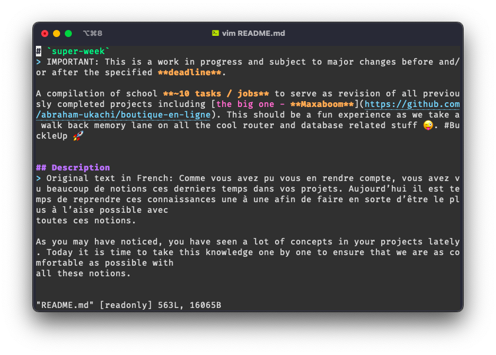
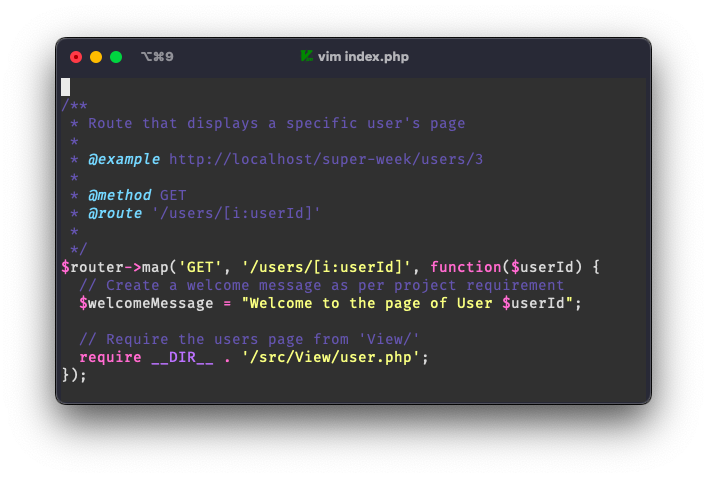
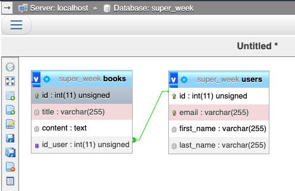
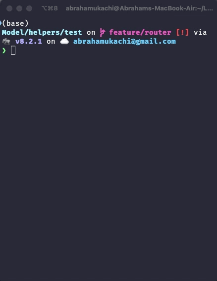
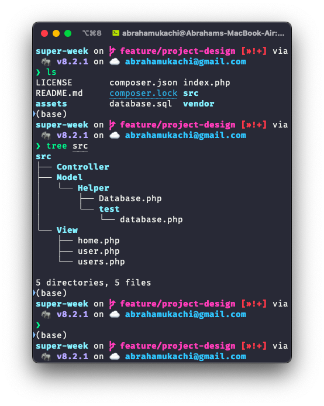
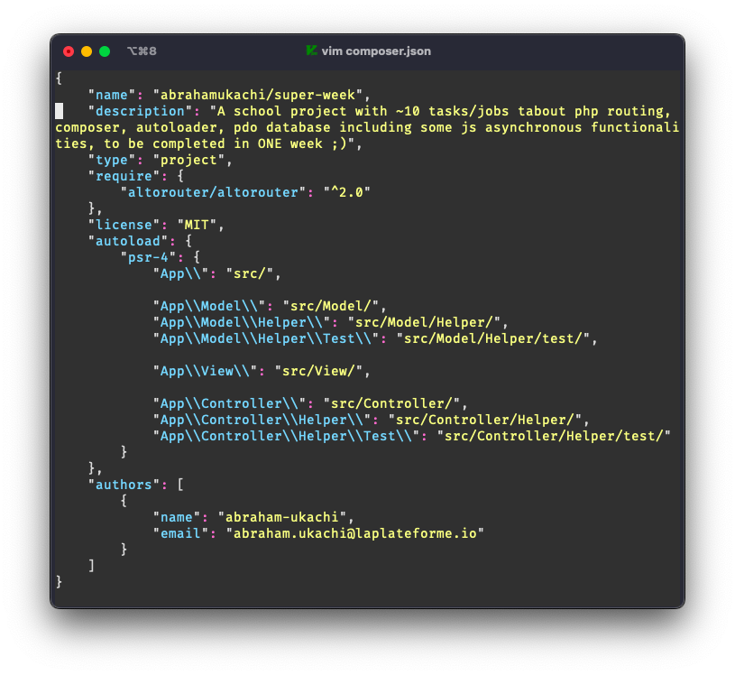
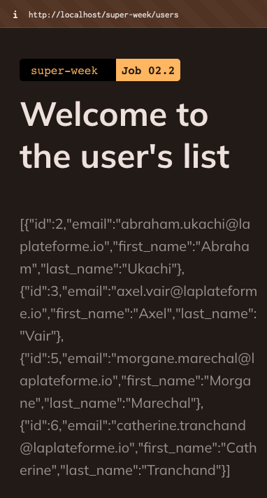
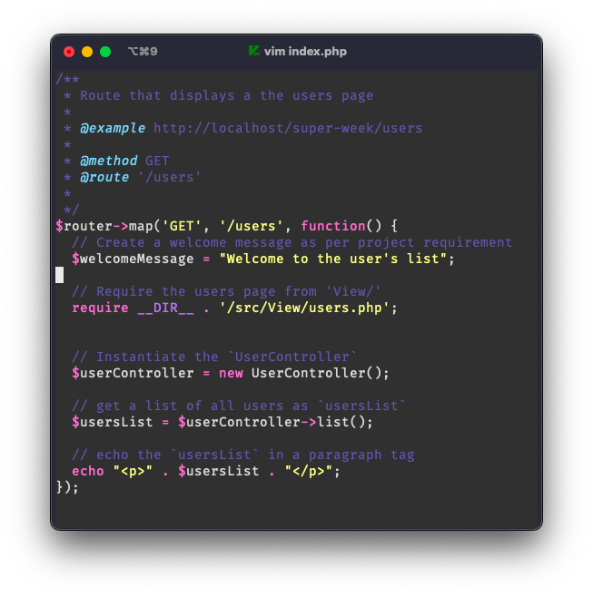
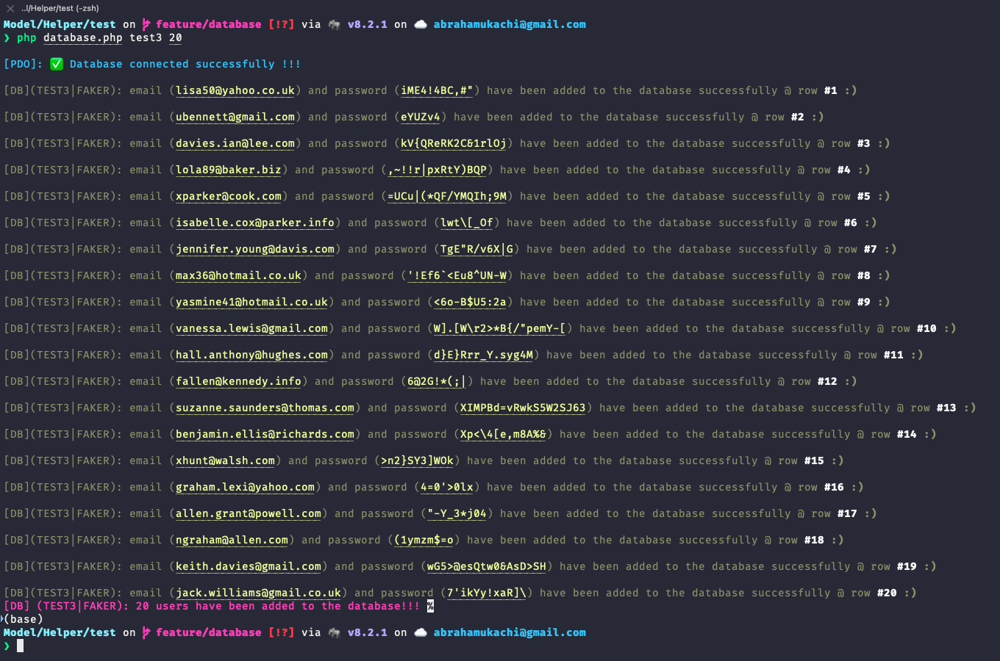
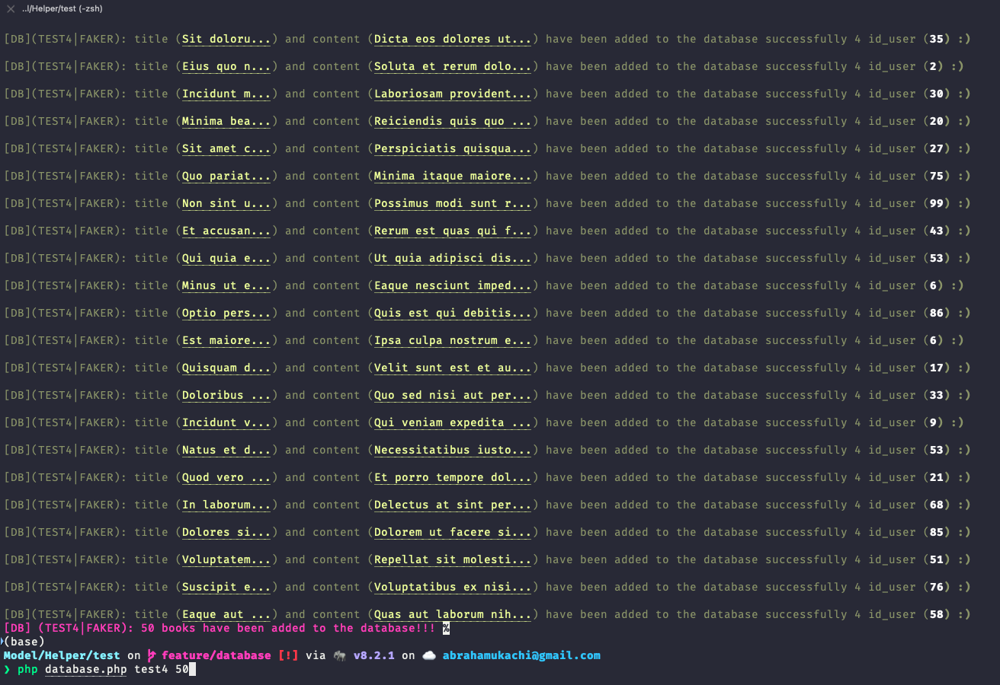

# `super-week`
> IMPORTANT: This is a work in progress and subject to major changes before and/or after the specified **deadline**.

A compilation of **~10 school tasks / jobs** to serve as revision of all previously completed projects including [the big one - **Maxaboom**](https://github.com/abraham-ukachi/boutique-en-ligne). This should be a fun experience as we take a walk back memory lane on all the cool router and database related stuff 😜. #BuckleUp 🚀


## Description
> Original text in French: Comme vous avez pu vous en rendre compte, vous avez vu beaucoup de notions ces derniers temps dans vos projets. Aujourd’hui il est temps de reprendre ces connaissances une à une afin de faire en sorte d’être le plus à l’aise possible avec
toutes ces notions.

As you may have noticed, you have seen a lot of concepts in your projects lately. Today it is time to take this knowledge one by one to ensure that we are as comfortable as possible with
all these notions.


## Requirements

These are a couple of the main requirements for this school project:

1. 


## Jobs
> MOTTO: I'll always do [**more**](#More) 😜

The official deadline of the jobs below - according to [intra](https://intra.laplateforme.io) - was **07/05/2023 à 10:44 AM**. Here is a list of all the tasks /jobs to be submitted and their corresponding / current **status**:

| No. | Job | Status |
|:----|:----|:-------|
| 1 | [*`Job 00`*](#Job-00) | [Done](./README.md) |
| 2 | [*`Job 01`*](#Job-01) | [Done](./index.php) |
| 3 | [*`Job 01.5`*](#Job-015) | [Done](./database.sql) |
| 4 | [*`Job 02.1`*](#Job-021) | [Done](./composer.json) |
| 5 | [*`Job 02.2`*](#Job-022) | [Done](./src/Controller/UserController.php) |
| 6 | [*`Job 02.3`*](#Job-023) | *_In progress_* |
| 6 | [*`Job 02.4`*](#Job-024) | Pending |
| 7 | [*`Job 03`*](#Job-03) | Pending |
| 8 | [*`Job 04`*](#Job-04) | Pending |
| 9 | [*`Job +`*](#Job-) | Pending |


> NOTE: (\*) = still needs to be updated \
>       (TBD) = To Be Determined ;)


## Structure

The folder & file structure of this project:

- [**src**](./src/)
- - [**Model**](./src/Model/)
- - [**View**](./src/View/)
- - [**Controller**](./src/Controller/)
- ...
- LICENSE
- README.md
- .htaccess
- **composer.json**
- **index.php**

> NOTE: This is just a snippet.


<details id=1>
<summary><h2>Job 00</h2></summary>

### Description of Job 00

First, as you are seasoned developers, you will initialize a new git project to track your project's change history.


### Requirements for Job 00

1. Add a ReadME to your project to explain to the world how your project is an exciting project where you will show off your full dev skills.

2. Make a commit taking into account your latest changes and push your project to [https://www.github.io/prenom-nom/super-week](https://www.github.io/abraham-ukachi/super-week).


### Tasks for Job 00

These are the following tasks of **Job 00** w/ their names and current status:

| No. | Name | Status |
|:----|:-----|:-------|
| 1 | *`README.md`* | [Done](./README.md)\* 
| 2 | *`Commit`* | [Done](#)


> NOTE: (\*) = still needs to be updated


### Random Screenshots for Job 00

| No. | GUI | CLI |
|:----|:----|:--------|
| 1 | N/A |  |

</details>


<details id=2>
<summary><h2>Job 01</h2></summary>

### Description of Job 01

Now that you've uploaded your changes, create a new **`feature/router`** branch and switch to it.
As you can imagine, you will install a router on your project to have clean URLs and start a project with a good base. Followed the documentation well, **taking the time to read** all the steps. As soon as the router is installed in your project, **make a commit**.

You can then import your router into an index.php file in the root of your project. Don't forget to use **composer's autoloader to retrieve the altorouter class**. 

Once that's in place, **make a commit**. Once your router is set up, do a few tests to make sure your router is working. When all your tests work, **commit again to save your progress**. Push your work to github and **pull request** from origin feature/router to main or master depending on your base branch name.

### Requirements for Job 01

Tests for router verification:

- **`/`**: displays a page in which there's a first-level title that says *"Welcome to the homepage"*.
- **`/users`**: displays a page with a top-level title that says *"Welcome to the Users list"*.
- **`/users/1`**: display a page with a first level title that says *"Welcome to the page of user 1"* where the __number__ changes depending on what is present in the URI.

### Tasks for Job 01

These are the following tasks of **Job 01** w/ their names and current status:

| No. | Name | Status |
|:----|:-----|:-------|
| 1 | *`feature/route - Branch`* | [Done](#Job-01)
| 2 | *`Composer & AutoLoader`* | [Done](./composer.json)
| 3 | *`AltoRouter - Installation`* | [Done](./composer.json)
| 4 | *`AltoRouter - Tests`* | [Done](./index.php)
| 5 | *`Commit & PR from 'feature/router' to 'main'`* | [Done](https://github.com/abraham-ukachi/super-week/pull/1)

> NOTE: (\*) = still needs to be updated

### Random Screenshots & Giphy Captures for Job 01

| No. | GUI | CLI |
|:----|:----|:--------|
| 1 | N/A |  |
| 2 |  |  


</details>


<details id=3>
<summary><h2>Job 01.5</h2></summary>

### Description of Job 01.5

Now that we have a router, we can start setting up our database to prepare the rest:

● A **user** table:
    ○ *`id`*, int
    ○ *`email`*, varchar(255)
    ○ *`first_name`*, varchar (255)
    ○ *`last_name`*, varchar(255)
● A **book** table:
    ○ *`id`*, int
    ○ *`title`*, varchar(255)
    ○ *`content`*, text
    ○ *`id_user`*, int


### Requirements for Job 01.5

1. Once the database is created, you can start populating your database with fake data in phpmyadmin so you can play around with it a bit.


### Tasks for Job 01.5

These are the following tasks of **Job 01.5** w/ their names and current status:

| No. | Name | Status |
|:----|:-----|:-------|
| 1 | *`database.sql`* | [Done](./database.sql)
| 2 | *`Database.php`* | [Done](./src/Model/Helper/Database.php)\*

> NOTE: (\*) = still needs to be updated


### Random Screenshots for Job 01.5

| No. | GUI | CLI |
|:----|:----|:----|
| 1 |  |  |


</details>


<details id=4>
<summary><h2>Job 02.1</h2></summary>

### Description of Job 02.1

Switch to your main or master branch and pull in your latest changes. Create a new **feature/project-design** branch and switch to it.

We have a database, we have a router, we are ready to develop our application. For this we will start to structure our folders with a **`src/`** folder at the root of our project. In this folder we will add 3 sub-folders: **`Model/`**, **`Controller/`**, **`View/`**.

The Model folder will contain all the classes that will make queries to the database. All classes in this folder will have the *“App\Model”* namespace.

The Controller folder will contain all the classes that will do the various checks and manipulations on the data sent to or retrieved from Models. All classes in this folder will have the namespace *“App\Controller”*.
The View folder will contain all the template files that display information to the user. There will be no classes a priori in this folder.

Remember to update your composer.json file to add the “App” namespace to your autoloader.
Make a commit and push your branch to the repo, make a pull request as before, and pull all changes to your main or master branch.

### Requirements for Job 02.1

1. Create & switch to a *`feature/project-design`* branch 
2. Create `Model/`, `Controller/` and `View/` folders in `src/`
3. Add corresponding MVC namespaces to **composer.json** and update it using `dumpautoload`
4. Create a pull request & checkout to *`main`* branch


### Tasks for Job 02.1

These are the following tasks of **Job 02.1** w/ their names and current status:

| No. | Name | Status |
|:----|:-----|:-------|
| 1 | *`feature/project-design - Branch`* | [Done](https://github.com/abraham-ukachi/super-week/tree/feature/project-design) |
| 2 | **`Model/`**, **`View/`**, **`Controller/`** in **`src/`** | [Done](./src) |
| 3 | *`Update namespaces in composer.json`* | [Done](./composer.json) | 

> NOTE: (\*) = still needs to be updated


### Random Screenshots for Job 02.1

| No. | GUI | CLI |
|:----|:----|:----|
| 1 | N/A |  |
| 2 | N/A |  |

> NOTE: (**N/A**) = not available ;)

</details>


<details id=5>
<summary><h2>Job 02.2</h2></summary>

### Description of Job 02.2

Switch to your main or master branch and pull in your latest changes. Create a new **feature/first-route** branch and switch to it. Once this is done, we will create a route to retrieve all the users of our application.


### Requirements for Job 02.2

1. Map a new route **`/users`**
2. Instantiate a new *UserController*
3. Create and call the `list()` method of your *UserController*
4. In this method, instantiate a new *UserModel*
5. Launch a `findAll()` method which retrieves all the users present in the database and returns them in the form of an associative array to the controller
6. With your Controller, return your table by encoding it in JSON format
7. And in your index echo your return
8. Make a final commit and push your branch to the repo, make a pull request as before, and pull all changes to your main or master branch.

> NOTE: For each of the steps described above, make commits

### Tasks for Job 02.2

These are the following tasks of **Job 02.2** w/ their names and current status:

| No. | Name | Status |
|:----|:-----|:-------|
| 1 | *`feature/first-route - Branch`* | [Done](https://github.com/abraham-ukachi/super-week/tree/feature/first-route) |
| 2 | *`UserController.php`* | [Done](./src/Controller/UserController.php)\* |
| 3 | *`UserModel.php`* | [Done](./src/Model/UserModel.php)\* |
| 4 | *`index.php`* | [Done](./index.php) |
| 5 | *`Final Commit & PR of 'feature/first-route' to 'main'`* | [Done](https://github.com/abraham-ukachi/super-week/pull/4) |

> NOTE: (\*) = still needs to be updated


### Random Screenshots for Job 02.2

| No. | GUI | CLI |
|:----|:----|:----|
| 1 |  |  |
| 2 | N/A | N/A |


> NOTE: (**N/A**) = not available ;)

</details>


<details id=6>
<summary><h2>Job 02.3</h2></summary>

### Description of Job 02.3

Switch to your main or master branch and pull in your latest changes. Create a new **feature/register** branch and switch to it.

Why not register our users with a form?

### Requirements for Job 02.3

1. Route **`/register`** with the verb *‘GET’* to display a registration form. The file containing the HTML for this form must be in a **`src/View/register.php`** file.
2. Then do another route **`/register`** with the verb *'POST’* to process the form with a `register()` method in the **AuthController**. This method will need to instantiate a **UserModel** in order to check if the user does not already exist and also to insert the registered user into the database.
3. Make a final commit and push your branch to the repo, make a pull request as before, and pull all changes to your main or master branch.

> NOTE: At each validated step, make a commit.


### Tasks for Job 02.3

These are the following tasks of **Job 02.3** w/ their names and current status:

| No. | Name | Status |
|:----|:-----|:-------|
| 1 | *`feature/register - Branch`* | [Done](https://github.com/abraham-ukachi/super-week/tree/feature/register) |
| 2 | *`Register - (GET) Route`* | [Done](./index.php) |
| 3 | *`Register - View`* | [Done](./src/View/register.php)\* |
| 4 | *`AuthController`* | *_In progress_* |
| 5 | *`Register - (POST) Route`* | Pending |
| 5 | *`Final Commit & PR of 'feature/register' to 'main'`* | Pending |

> NOTE: (\*) = still needs to be updated


### Random Screenshots for Job 02.3

| No. | GUI | CLI |
|:----|:----|:--------|
| 1 | N/A |  |
| 2 | N/A |  |
| 3 | N/A | N/A |


</details>


<details id=7>
<summary><h2>Job 02.4</h2></summary>

### Description of Job 02.4  

Switch to your main or master branch and pull in your latest changes. Create a new feature/login branch and switch to it.

Use the same principle for the connection with two **`/login`** routes, one with the verb *‘GET’* and one with the verb *‘POST’*.

Make a final commit and push your branch to the repo, make a pull request as before, and pull all changes to your main or master branch.

### Requirements for Job 02.4  

> NOTE: For each step, make commits.


### Tasks for Job 02.4  

These are the following tasks of **Job 02.4** w/ their names and current status:

| No. | Name | Status |
|:----|:-----|:-------|
| 1 | *``* | Pending
| 2 | *``* | Pending

> NOTE: (\*) = still needs to be updated


### Random Screenshots for Job 02.4  

| No. | GUI | CLI |
|:----|:----|:----|
| 1 | - | - |


</details>


<details id=8>
<summary><h2>Job 03</h2></summary>

### Description of Job 03  

For this part, we leave it up to you to branch as you go, as well as regular commits.

### Requirements for Job 03  

Now that your users can connect, you will be able to create the following set of routes:

- GET **`/users/[i:id]`**: Retrieves user information with the id specified in parameter and displays it in JSON format
- GET **`/books/write`**: Displays the add book form
- POST **`/books/write`**: Adds a new book to the database with the currently connected user as author
- GET **`/books`**: Retrieves information from all books and displays them in JSON format
- GET **`/books/[i:id]`**: Retrieves information from the book with the id specified as a parameter and displays it in JSON format
- GET **`/logout`**: Logs out the user

> NOTE: Remember to make pull requests regularly and maintain good work hygiene in your project.

### Tasks for Job 03  

These are the following tasks of **Job 03** w/ their names and current status:

| No. | Name | Status |
|:----|:-----|:-------|
| 1 | *``* | Pending
| 2 | *``* | Pending

> NOTE: (\*) = still needs to be updated


### Random Screenshots for Job 03  

| No. | GUI | CLI |
|:----|:----|:----|
| 1 | - | - |


</details>


<details id=9>
<summary><h2>Job 04</h2></summary>

### Description of Job 04  

We have a lot of routes that are returning JSON to us, it could be good to make sure to display things on our page, right?

Map a new route **`/`** with the verb ‘GET’. If this route already exists in your code, we'll override how it works.

### Requirements for Job 04  

Make this route display an html page with a structure in which you will have:

- a button to retrieve all the users returned by the **`/users`** route and display them on your page.
- a button to retrieve all the books returned by the **`/books`** route and display them on your page.
- An input and a button to retrieve a particular user with the route **`/users/[i:id]`** and display their information on your page.
- An input and a button to retrieve a particular book with the route **`/books/[i:id]`** and display its information on your page.

> NOTE: Apart from the basic structure of your page, all displays on your page must be done with the creation of HTML elements via JavaScript. So you have to use fetch and asynchronous functions to do these different functionalities.

### Tasks for Job 04  

These are the following tasks of **Job 04** w/ their names and current status:

| No. | Name | Status |
|:----|:-----|:-------|
| 1 | *``* | Pending
| 2 | *``* | Pending

> NOTE: (\*) = still needs to be updated


### Random Screenshots for Job 04  

| No. | GUI | CLI |
|:----|:----|:----|
| 1 | - | - |


</details>


<details id=10>
<summary><h2>Job +</h2></summary>

### Description of Job +  

You may have noticed that your project has a lot of repetitions in some places. Maybe you could factor your code to avoid this?

Use inheritance and abstract classes to factorize your code and make it more concise.

If you wish, you can also use interfaces to make sure you have a little more structure in your classes.

As for javascript, did you use modern javascript with the use of arrow functions, async and await keywords?

### Requirements for Job +  

-

### Tasks for Job +  

These are the following tasks of **Job +** w/ their names and current status:

| No. | Name | Status |
|:----|:-----|:-------|
| 1 | *``* | Pending
| 2 | *``* | Pending

> NOTE: (\*) = still needs to be updated


### Random Screenshots for Job +  

| No. | GUI | CLI |
|:----|:----|:----|
| 1 | - | - |


</details>


---


## Installation
> IMPORTANT: Make sure you have [`XAMPP`](https://www.apachefriends.org/) already installed on your computer before proceeding.

1. Clone this project's repository
```sh
git clone https://github.com/abraham-ukachi/super-week.git
```

> NOTE: There's no need to change the current working directory to **super-week**


2. Now, create a symbolic link of **super-week** in the `XAMPP`'s **htdocs** folder:

-   **On Mac**

```sh
ln -s "$(pwd)/super-week" /Applications/XAMPP/htdocs/super-week
```
-   **On Linux**

```sh
ln -s "$(pwd)/super-week" /opt/lampp/htdocs/super-week
```

3. Open the **super-week** folder in your default browser:

```sh
open http://localhost/super-week
```


---

## Testing

| Browser | Version | Status | Date | Time
|:--------|:--------|:-------|:-----|:-----
| *`Arc`* | **0.98.2** | [Tested](http://localhost/super-week) | 03/05/2023 | 11:28 AM
| *`Brave`* | **-** | *Pending* | - | -
| *`Chrome`* | **-** | *Pending* | - | -
| *`Firefox`* | **-** | *Pending* | - | - 
| *`Safari`* | **-** | *Pending* | - | -
| *`Opera`* | **-** | *Pending* | - | -
| *`Edge`* | **-** | *Pending* | - | -
| *`IE`* | **-** | *Pending* | - | -

> NOTE: *`IE`* = Internet Explorer = 👎🏽


## More 
> IMPORTANT: Check out my source code, if you've got some time. Who knows, you might even fall in love #lmao ;)

These are some of the things I did in addition to this project's [job requirements](#Requirements):

| No. | Name | File | Status |
|:----|:-----|:-----|:-------|
| 1 | *`Database - Test`* | **database.php** | [Done](./src/Model/Helper/test/database.php)\* |
| 2 | *`User Model - Test`* | **user_model.php** | [Done](./src/Model/test/user_model.php)\* |
| 3 | *`??`* | **??** | ?? | 


> NOTE: (\*) = still needs to be updated. <br>
> There's certainly a couple of file we must've forgot or not added yet, so we'll keep the above list updated obv. :)


## TODOs

- [ ] Optimize all `.php` files
- [ ] Optimize all `.css` files
- [ ] Optimize all `.js` files
- [ ] Remove unnecessary comments
- [ ] Add screenshots
